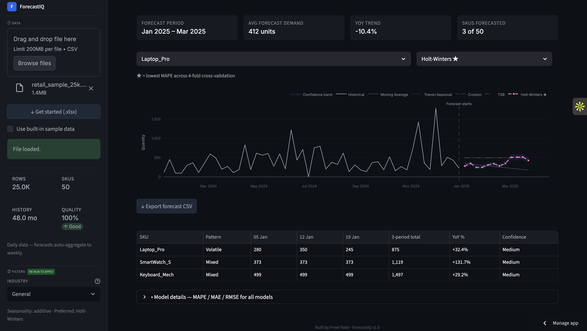

# ForecastIQ - Demand Forecasting Tool

**A browser-based demand forecasting tool built for supply chain planners.**  
Upload any CSV with historical demand data and get an S&OP-ready forecast in under a minute. No login, no setup, no data stored.

[](https://preetpatel-forecastiq.streamlit.app/)

---



---

## What It Does

Most supply chain teams either rely on Excel trend lines that break down with seasonal or intermittent demand, or they pay for enterprise tools they barely use. ForecastIQ sits in the middle — it runs five industry-standard forecasting models simultaneously on any CSV upload, automatically picks the best one using cross-validation, and delivers a forward planning table in the format a demand planner brings to an S&OP meeting.

---

## How It Works

**1. Upload** — drag and drop any CSV with Date, SKU, and Quantity columns. Category, Location, and Price are detected automatically if present.

**2. Select** — choose SKUs manually or let the Pareto top-N selector pick the highest-revenue items automatically.

**3. Run** — click Run Forecast. Five models compete. The winner is selected by lowest WAPE across 4-fold rolling cross-validation.

**4. Export** — download the forecast CSV or take the forward planning table straight into your S&OP deck.

---

## The Five Models

| Model | Best For |
|-------|----------|
| **Croston** | Intermittent demand — spare parts, MRO, slow-moving SKUs |
| **TSB** (Teunter-Syntetos-Babai) | Intermittent demand that may permanently die out |
| **Holt-Winters** | Seasonal demand — retail, FMCG, consumer products |
| **Trend+Seasonal** | Trend-led demand with periodic market effects |
| **Moving Average** | Stable, predictable demand — used as the benchmark |

Every SKU gets all five. The best model is selected automatically by WAPE (Weighted Absolute Percentage Error) across four holdout windows — not just fit to history, but tested on periods the model never saw.

---

## Output

- **Forecast chart** — historical demand + all 5 model lines with the recommended model highlighted, confidence band (±15%) shaded
- **Forward planning table** — 3-period quantities per SKU, quarter total, YoY % vs prior year, confidence label (High / Medium / Low)
- **Export CSV** — Date, SKU, Forecasted Qty, Lower Bound, Upper Bound, Best Model, MAPE %, Confidence, Demand Pattern
- **Model details panel** — MAE, WAPE, RMSE for all 5 models, collapsed by default

---

## Demand Pattern Classification

Before forecasting, each SKU is automatically tagged:

- **Stable** — low variability (CV ≤ 0.4), routine replenishment applies
- **Mixed** — moderate variability, planner judgment recommended
- **Volatile** — high variability (CV > 0.8), use forecast with a buffer
- **Intermittent** — 50%+ zero-demand periods, Croston/TSB preferred

---

## Data Format

Required columns: `Date`, `SKU`, `Quantity`  
Optional (auto-detected): `Category`, `Location`, `Price`

Column order doesn't matter — detection is name-based. Download the built-in guide for a full template and format reference.

```
Date,SKU,Quantity,Category,Location
2024-01-07,SKU-001,120,Electronics,Store_A
2024-01-14,SKU-001,98,Electronics,Store_A
```

Minimum 30 data points per SKU. SKUs below this threshold are skipped automatically.

---

## Privacy

Your data never leaves your browser. The forecasting engine runs entirely within your Streamlit session — nothing from your CSV is transmitted or stored. Anonymous usage stats (SKU count, horizon, industry setting) are logged for product improvement.

---

## Tech Stack

Python · Streamlit · Plotly · Pandas · NumPy · Statsmodels

---

## Built By

**Preet Patel**  
M.S. Engineering Management | USC Viterbi '26  
Graduate Certificate in Optimization & Supply Chain Management  

[](https://linkedin.com/in/preetpatel01)
[](https://github.com/preet11299)
